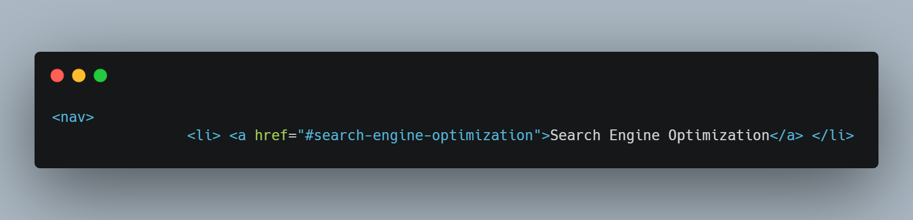

# 01 HTML, CSS, and Git: Code Refactor mini assignment

<h1 align="center">Horiseon Refactoring</h1>

<h2>Purpose of Refactoring</h2>

 Horiseon has requested that our marketing agency refactor their existing code base to meet accesability standards so that their website is optimised for search engines. This requires the addition of alt attributes to imformative images, a refactoring of the code to make the elements semantic and easier to follow, a removal of repeated code in the HTML and CSS, and also to ensure all links function correctly 
 

<h2> Method </h2>

1. The first step was, starting from the top, to rename the div classes to accurately reflect their function

 change the div class="header", to the header element, add a section, and change ul to nav 
 Original code

Refactored code

2. chavge div class content to main class content, to reflect main section of html, Alt attributes were also added to the img's to meet accessability standards. 
Original code

Refactored code

 

3. change dis class benefits, to an aside to represent the side bar, also added null alt attributes to the decorative imgs on all 3 sections. 
Original code

Refactored code

4. changed div class footer, to footer element 
original code

refactored code

5. fixed broken link for serach engine optimization, div was incorrectly labbeled as a class instead of an ID. 
Original code

Refactored code

6. Split original CSS stylesheet into 3 new style sheets and remove duplicate code, to improve function and ease of interpertaion.

